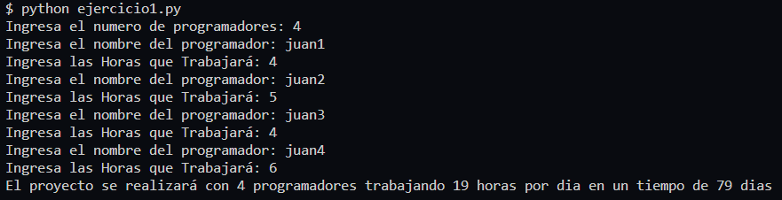

# **Ejercicio 1**

Realizar u algoritmo que permita realizar el calculo del tiempo en dias de entrega de un proyecto de software con las siguientes consideraciones

* El numero de programadores y sus horas trabajadas es variable, se define a la hora de contratacion, considerar que como minimo se deben tener 4 programadores y con 3 horas diarias cada uno.
* Las horas claculadas para el desarrollo del proyecto total son: 1500 horas.

## **Solución**

[Codigo de Solucion - ejercicio1.py](ejercicio1.py)

[_**<<< Inicio**_ ](/README.md)