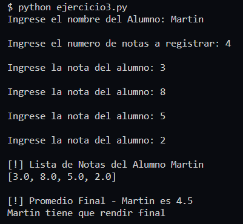
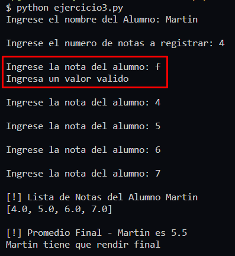
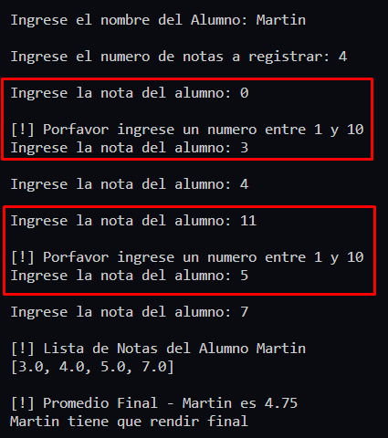

# **Ejercicio 3**

Pedir el ingreso por teclado de 3 valores numericos enteros entre 1 y 10 correspondientes a las notas de un alumno.
En base al promedio final de las tres notas, mostrar un mensaje por pantalla que indique si el alumno promociona la materia(nota final 7,8,9 o 10), debe rendir final(notal final 4,5o 6) o recursa (nota 1,2,3)

## **Solución**

[Codigo de Solucion - ejercicio3.py](ejercicio3.py)

[_**<<< Inicio**_ ](/README.md)