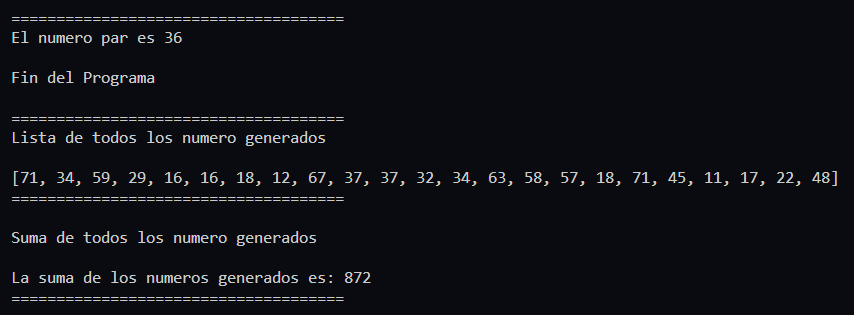
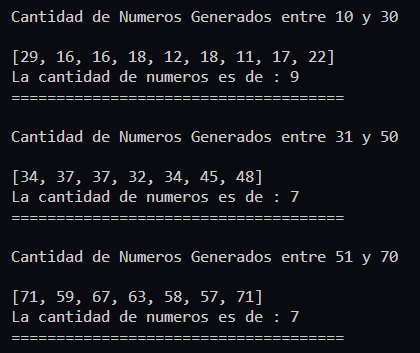

# **Ejercicio 4**

Diseñe un programa que genere numeros aleatorios enteros del intervalo 10 a 70 hasta obtener un numero mayor a 35 pero menor que 45. El programa mostrará: 
    
- los numeros generados
- La suma de todos los numeros generados
- La cantidad de numeros generados del intervalo 10 a 30 
- la cantida de numeros generados del intervalo 31 a 50
- la cantidad de numeros generados del intervalo 51 a 70 

## **Solución**

[Codigo de Solucion - ejercicio4.py](ejercicio4.py)

[_**<<< Inicio**_ ](/README.md)