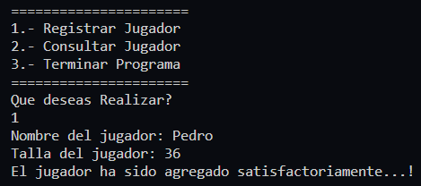
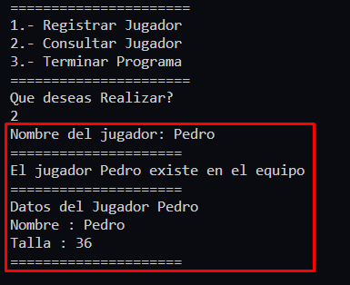

# **Ejercicio 5**

Nuevo Equipamiento de Futbol

Cada miembro de un equipo de futbol ha decidido encargar un par de nuevas botas. Necesitamos escribir un programa en el sea posible ingresar los nombres y tallas de los jugadores de futbol y, que se muestren las tallas de los jugadores usando sus nombres. Si la persona no existe, se debe mostrar "No existe dicha persona en el Equipo"

## **Solución**

[Codigo de Solucion - ejercicio5.py](ejercicio5.py)

[_**<<< Inicio**_ ](/README.md)