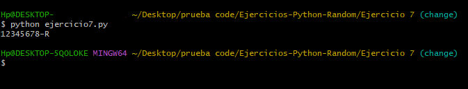

# **Ejercicio  7**

Crea una clase NIF que se usará para mantener DNIs con su correspondiente letra. Los atributos serán el numero de DNI (entero) y la letra que le corresponde.

La clase dispondrá de los siguientes metodos: 

- Constructor predeterminado que inicialice el numero de DNI a 0 y la letra a espacio en blanco (será un NIF no valido).

- Constructor que reciba DNI y se establezca la letra que le corresponde.

- Accedentes para el numero de DNI (que ajuste automaticamente la letra)

- Leer(): que pida el numero de DNI (ajustando automaticamente la letra)

- Metodo que nos permita mostrar el NIF (8 digitos, un guion y la letra en mayuscula; por ejemplo: `00395469-F`)

## **Solución**

[Codigo de Solucion - ejercicio7.py](ejercicio7.py)

