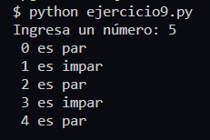

# **Ejercicio 9**

Solicita un numero e imprime todos los numeros pares e impares desde 1 hasta ese numero con el mensaje `"es par"` o `"es impar"`

## **Solución**

[Codigo de Solucion - ejercicio9.py](ejercicio9.py)

[_**<<< Inicio**_ ](/README.md)